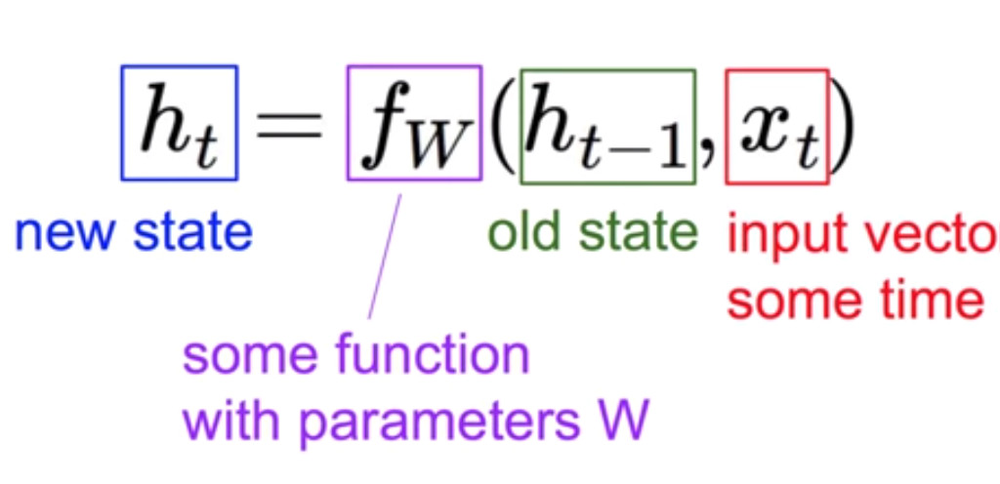
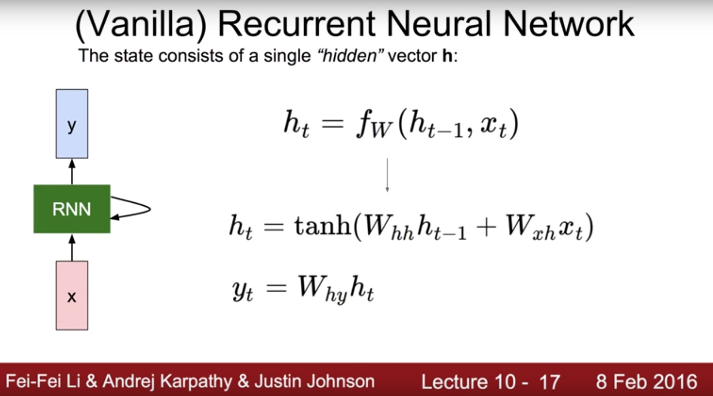
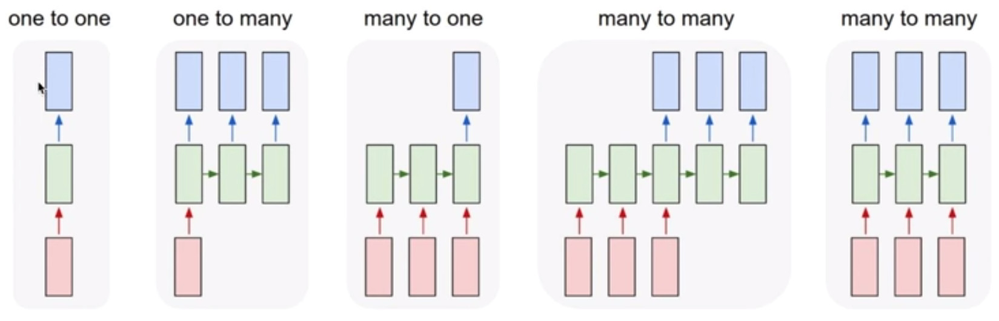

# RNN(Recurrent Neural Network)

squnce data를 받아서 처리 할 수 있는 NN모델

--------------------------------------------------------------------------------

## squence data

우리는 하나의 데이터를 보고 상황을 이해하는 것이 아니라 앞 뒤 상황을 보고 상황을 이해한다. 
음악 혹은 영상, 말, 주식 등은 지금만 보고 판단하는것이 아니라 
전에 있던 내용을 살펴봐야 된다. 

**즉 지금의 상황이 다음 결과에 영향을 미치는 것** 이 squence data 이다. 

CNN 또는 NN은 이러한 데이터를 처리 할 수 없다.

--------------------------------------------------------------------------------

## RNN model

RNN은 squence data를 처리하기 위한 모델이다. 
이 squence data를 처리하기 위해서 RNN은 어떠한 입력에 대한 처리가 있고 
이 입력을 **처리한 결과(상태)가 다음에 연산에 영향을 미치는 구조** 이다.

--------------------------------------------------------------------------------

## RNN 계산법

RNN에는 state라는 개념이 존재하는데, 이 state를 계산하는 방법은 

이전의 state와 입력 x를 가지고 어떠한 함수를 이용해 연산을 하게된다.

이 계산은 모든 RNN셀이 같기 때문에 
대부분의 RNN 모형에서 하나로 표현하는 경우가 많다

### Vanilla RNN

가장 기본적인 방식으로 우리가 좋아하는 **Y = WX** 를 가지고 구성하게 된다. 
이전에 state와 입력 값이 들어오게 되면 각각에 weight를 만들어 더하고. 
그 뒤 tanh로 현제의 state를 계산한다. 이는 다음에 전달하게 될 state로 다음 연산에서 사용된다. 
 
Y를 계산 하고 싶다면, 또 **Y = WX** 연산을 사용한다. 
간단하게 이번에 연산되어진 state에 또 다른 weight를 곱하면 된다. 

이렇게 되면 총 3개의 weight가 필요한데 이 weight는 **모든 RNN셀의 연산이 같기 때문에** 
모든 셀에서 공통되게 사용된다.

--------------------------------------------------------------------------------

## 다양한 RNN 활용

본인이 RNN을 어떻게 구성하느냐에 따라서, 다양하게 RNN을 활용할 수 있다. 

하나의 이미지에서 문장을 만들어 설명하는 방식(one to many)부터 
문장의 주제 & 분위기를 분석하거나(many to one) 
번역이나 각 비디오 프레임에 따른 상황 판단(many to many) 

자신이 활용하고 싶은 분야에 다양한 적용이 가능하다.

--------------------------------------------------------------------------------

### 참고

<https://www.youtube.com/watch?v=A8wJYfDUYCk>
